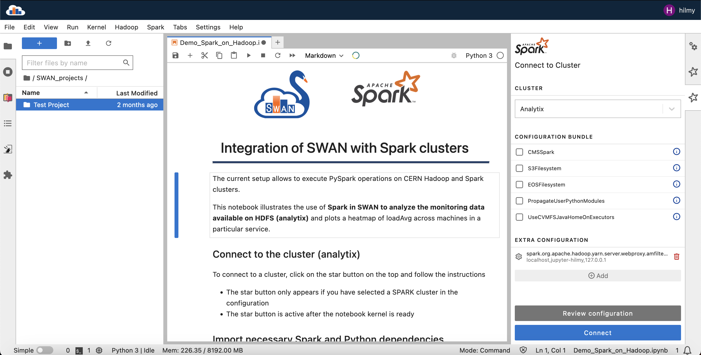
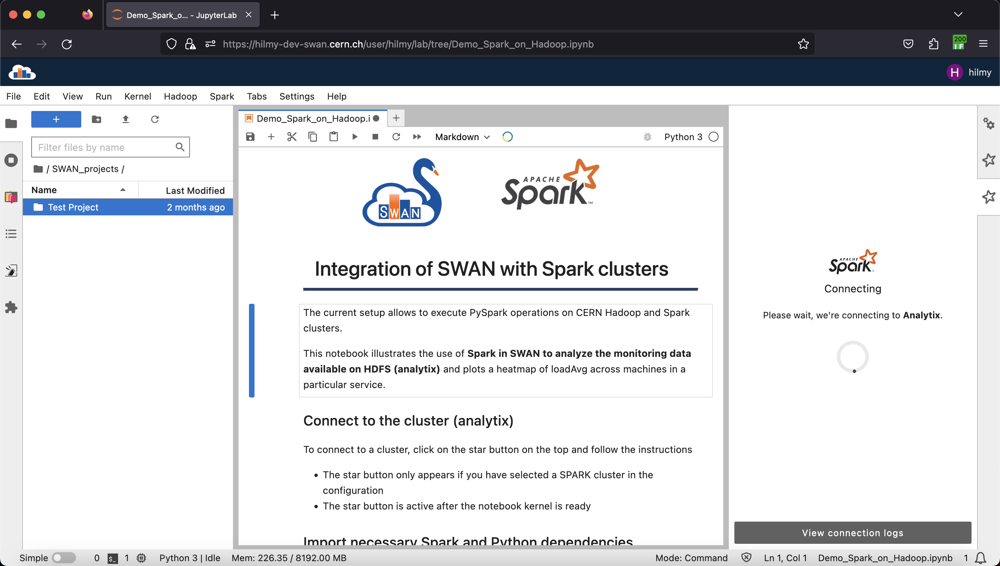
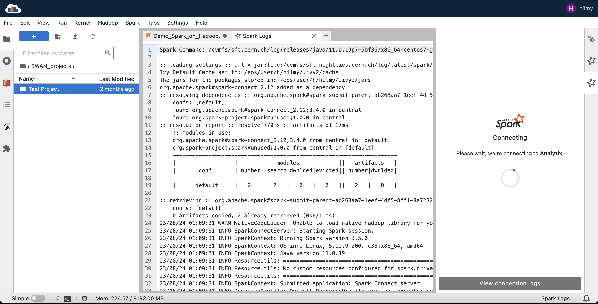
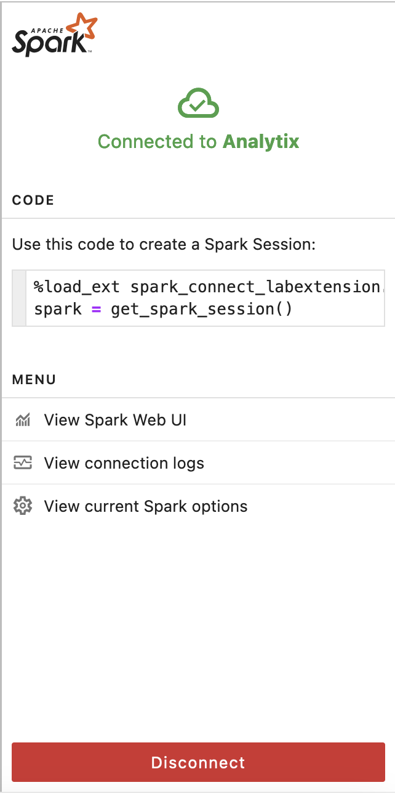
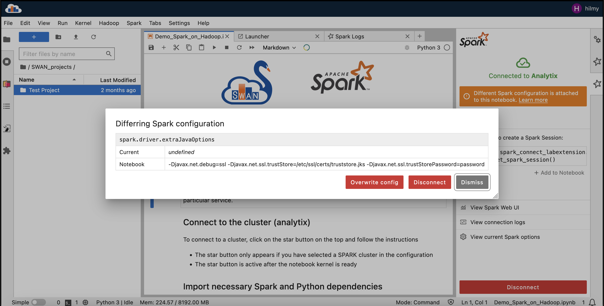

# Leverage Spark Connect for interactive data analysis in Jupyter Notebooks

Google Summer of Code 2023 with CERN-HSF by Muhammad Aditya Hilmy <mhilmy@hey.com>

## Introduction

### Project Brief

This project offers the source code for a Jupyter Lab extension designed to streamline the process of connecting to an Apache Spark cluster and sharing this connection across multiple notebooks. Building upon the limitations of previous connection methods which necessitated a dedicated "think" connection, our extension leverages the newly released Apache Spark Connect functionality and its configurations. While originally tailored to enhance the user experience of the CERN SWAN service, this open-source extension can benefit the broader Jupyter Lab and Apache Spark community. 

### About SWAN

[SWAN](https://cern.ch/swan) (Service for Web-based ANalysis) is a platform to perform interactive data analysis directly using a web browser. Scientists and engineers, both at CERN and at partner institutes, are using SWAN on a daily basis to develop algorithms required to perform their data analyses. The SWAN service builds on top of the widely-adopted [Jupyter Notebooks](http://jupyter.org) and, more recently, the new [JupyterLab](https://jupyterlab.readthedocs.io) interface. SWAN integrates access to CERN software libraries, storage solutions, and compute resources. Notably, it integrates with [CERNBox](https://cernbox.web.cern.ch) for storage synchronization and sharing capabilities, and with the CERN [Spark](https://spark.apache.org/)/[Hadoop](https://hadoop.apache.org/) clusters for scale out capabilities.

Currently, SWAN uses the Apache Spark Python API to connect Python notebooks to Spark clusters. This works by allocating a Spark Session object that is private to the Python process (the user’s notebook session), which becomes the driver of the distributed computation. The Spark Session on the driver machine can then request worker processes, called executors, from the cluster manager and schedule Spark jobs to be run in parallel utilizing the executors’ resources.

The architecture has proven to work well and provide a scale out solution to SWAN users. However, a few important limitations have come apparent when using Spark on notebooks, due to the tightly coupled Spark driver architecture. The lack of built-in client-server connectivity in Spark (up to version 3.3.x) means, for example, that users need to spawn a new Spark Session for each of their notebooks, an operation that is resource intensive and has a high latency. These and other limitations are addressed in the latest development by the Apache Spark community, with the Spark Connect component (available from Apache Spark version 3.4.0, released in April 2023). Spark Connect is a major improvement in Apache Spark and brings more flexibility to the interactive data analysis use cases with Jupyter notebooks. This improves the experience of SWAN users who offload computations to Spark clusters, by allowing to use Spark in client-server mode, which simplifies the configuration, and by sharing connectivity to Spark clusters to improve resource utilization, among others.

## Work Results

### Spark Connect Labextension

The extension's source code is available in [https://github.com/didithilmy/spark-connect-labextension](didithilmy/spark-connect-labextension). Documentations on how to install and use the package is available on the repo README.

#### Pull Request

This extension is in the process of being merged to SWAN's monorepo. Pull request here: [swan-cern/sparkconnect#1](https://github.com/swan-cern/sparkconnect/pull/1)

#### Features
1. Create Spark Connect connection from the Lab sidebar
2. Allow users to configure the Spark connection from the UI
3. View Spark connection logs
4. Access Spark Web UI from the lab interface

#### Screenshots

### Considerations

There are several ways that we consider on how to use the Spark Connect API:
1. Run the Spark driver at user space
2. Provision a shared Spark driver and have the clients connect to the same instance
3. Provision a unique Spark driver per user and run it somewhere else

We ended up going with the first option, because 1) it is the simplest to implement, 2) the extension can work on its own (no need to couple it with a resource spawner such as kubespawner), and 3) we can make it not CERN-specific.

In the current approach, when the user starts a cluster, the extension starts a Spark Connect server and the Spark driver inside the user container, and expose the server at port 15002. Then, a kernel extension exposes a Python function to retrieve the Spark Session to connect to the server process.

### Future Improvements
- A monitoring feature similar to swan-cern/sparkmonitor can be implemented once the Spark Connect API supports this.
- CI/CD pipeline for extension testing and publishing needs to be established.

### Conclusions

This GSoC project aims to develop a JupyterLab extension that integrates with Apache Spark's novel feature known as Spark Connect. This addresses some limitations in the current Spark Connector extension used by SWAN at CERN. The extension has been developed and made open source.

### Acknowledgements

I would like to thank the people at the SWAN team, Enric, Diogo, Luca, and Jose, for mentoring and giving me guidance throughout this project.

